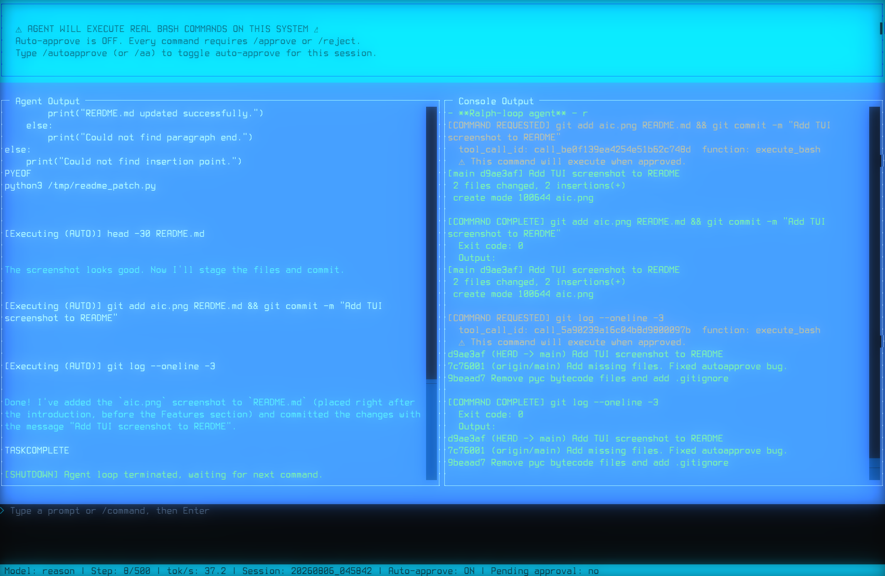

# AI-Commander

AI-Commander is a **ralph-loop AI agent** that provides shell access and task
planning capabilities to Large Language Models through function calling. It
runs a tight agent loop: it plans, executes shell commands, observes the
results, and iterates until the requested task is complete — all while you stay
in control through an approval gate.

It supports two presentation modes:

- **Default (TUI)** — a [Textual](https://textual.textualize.io/)-based terminal
  UI with split panels (prompt, console, agent output, status footer) and an
  `/autoapprove` toggle for the approval gate.
- **`--nogui`** — the original direct-CLI behaviour (stdout/stderr, no TUI).



---

## Table of Contents

- [Features](#features)
- [Requirements](#requirements)
- [Installation](#installation)
- [Usage](#usage)
- [Command-line options](#command-line-options)
- [How it works](#how-it-works)
- [The TUI](#the-tui)
  - [Layout](#layout)
  - [Slash commands](#slash-commands)
  - [Keyboard shortcuts](#keyboard-shortcuts)
  - [Prompt history](#prompt-history)
- [The approval gate](#the-approval-gate)
- [Context compression](#context-compression)
  - [How the budget works](#how-the-budget-works)
  - [The `truncate` algorithm](#the-truncate-algorithm)
  - [The `context-compressor-llm` algorithm](#the-context-compressor-llm-algorithm)
  - [Choosing an algorithm](#choosing-an-algorithm)
- [Sandboxing (Linux)](#sandboxing-linux)
- [Fast mode](#fast-mode)
- [Debugging](#debugging)
- [Project structure](#project-structure)
- [License](#license)

---

## Features

- **Ralph-loop agent** — repeatedly plans, executes, and observes until the
  task is done.
- **Shell access** — runs arbitrary commands and captures their output.
- **Web search** — using the duck-duck-go `ddgs` Python package (installed via requirements.txt).
- **Approval gate** — review each command before it runs, or auto-approve.
- **Thinking tokens** — optional display/hiding of reasoning output.
- **Command timeouts** — prevent runaway commands (configurable).
- **Output limits** — command output is capped and truncated with a sentinel so
  the model never receives unbounded text.
- **Context compression** — two pluggable algorithms keep the conversation
  history within the model's prompt budget.
- **OS-level sandbox** — optional [Landlock](https://landlock.io/) sandbox on
  Linux to restrict writes to the working directory, `/tmp`, `/dev`, and
  `/dev/pts`.
- **Two presentation modes** — full TUI or plain CLI (`--nogui`).
- **Prompt history** — readline-style history with reverse incremental search
  (Ctrl+R) in the TUI.

---

## Requirements

- Python 3.9+
- An OpenAI-compatible API endpoint (any provider that exposes the
  `/chat/completions` interface).

---

## Installation

Clone the repository and install the dependencies:

```bash
git clone https://github.com/ortegaalfredo/AICommander
cd AICommander
python3 -m venv venv
source venv/bin/activate
pip install -r requirements.txt
```
> **Note:** The `py-landlock` package is only used on Linux and
> is optional — the agent runs unsandboxed if it is not installed.

---

## Usage

AI-Commander is a single-file script. Run it from the repository root:

```bash
python3 aic.py \
  --api-base https://api.example.com/v1 \
  --model your-model-name \
  --api-key YOUR_API_KEY \
  "your task request"
```

The TUI starts with no request and waits for you to type one in the prompt
panel. In `--nogui` mode a request is required on the command line.

### Command-line options

| Option | Description |
| ------ | ----------- |
| `--api-base` | API base URL (required). |
| `--model` | Model name (required). |
| `--api-key` | API key (required). |
| `--auto-approve` | Auto-approve command execution (for testing). |
| `--no-thinking` | Hide thinking tokens from output. |
| `--timeout` | Command timeout in seconds (default: `120`). |
| `--max-prompt-len` | Maximum prompt length in tokens (default: `80000`). |
| `--max-output-bytes` | Maximum output bytes returned from commands (default: `10240`). |
| `--max-steps` | Maximum number of agent loop steps before stopping (default: `500`). |
| `--debug` | Enable debug mode (dump conversation history on truncation). |
| `--nogui` | Run in direct CLI mode without TUI (original behaviour). |
| `--disable-sandbox` | Disable the OS-level Landlock sandbox (Linux only). |
| `--compress-alg` | Context-compression algorithm (`context-compressor-llm` or `truncate`). |
| `--compress-target` | Fraction of the prompt budget retained as headroom (default: `0.4`). |
| `--fast` | Fast mode: force `truncate` compression and a smaller system prompt. |
| `--reasoning-effort` | Reasoning effort for the LLM (e.g. `low`, `medium`, `high`). |
| `request` | The task request (positional, required in `--nogui` mode). |

### Example

```bash
# Run in the TUI (default)
python3 aic.py --api-base https://api.example.com/v1 \
  --model gpt-4o --api-key sk-... "List all files in this directory"

# Run in plain CLI mode
python3 aic.py --nogui --api-base https://api.example.com/v1 \
  --model gpt-4o --api-key sk-... "Summarize the contents of aic.py"

# Auto-approve all commands (useful for testing / scripting)
python3 aic.py --auto-approve --api-base https://api.example.com/v1 \
  --model gpt-4o --api-key sk-... "Set up a new Python project"

# Use the truncation algorithm and a smaller, faster prompt
python3 aic.py --fast --api-base https://api.example.com/v1 \
  --model gpt-4o --api-key sk-... "List all files"
```

---

## How it works

1. The agent receives your task request.
2. It plans the next step and may emit *thinking* tokens.
3. It proposes shell commands, which you approve or auto-approve.
4. Commands run (optionally sandboxed and time-limited), and their output is
   fed back to the model.
5. The loop repeats until the task is considered complete.

All I/O is routed through the `EventSink` abstraction, so the same agent logic
runs unchanged in both the TUI and `--nogui` modes.

The agent exposes a single tool, `execute_bash(command)`, which runs the
command in a pseudo-terminal (PTY). The PTY gives the command a real terminal
environment (so interactive tools and `tput`-style programs work) and lets the
agent capture output, enforce a timeout, and kill the whole process group when
needed. Output is streamed live to the console panel and the final result is
truncated to `--max-output-bytes` with the literal sentinel
`output too long: truncated` appended when the limit is exceeded.

---

## The TUI

### Layout

The default Textual interface is a Norton-Commander-style split screen:

- **Left panel — Agent Output**: the model's streamed responses, thinking
  tokens, and status messages.
- **Right panel — Console Output / Shell**: two tabs. *Console Output* shows
  the commands the agent runs and their live output; *Shell* is an embedded
  interactive shell you can use yourself.
- **Bottom — Prompt input**: type a task or a slash command.
- **Status footer**: model, current step, live context-window estimate,
  cumulative token total, tokens/second, session id, auto-approve state,
  pending-approval indicator, and sandbox status.

The agent runs in a background thread and communicates with the UI through a
queue; the UI never blocks on the agent.

### Slash commands

Type any of the following in the prompt panel (they are UI controls, so they
are **not** added to prompt history):

| Command | Aliases | Description |
| ------- | ------- | ----------- |
| `/autoapprove` | `/aa` | Toggle auto-approve on/off for this session. When ON, commands run without asking. |
| `/approve` | — | Approve the currently pending command. |
| `/reject` | — | Reject the currently pending command. |
| `/suggest <text>` | — | Reject the pending command **with a steering suggestion** that is fed back to the agent (e.g. `/suggest use a different approach`). |
| `/clear` | `/new` | Clear the conversation history and start a fresh session (resets tokens, step count, and session id). |
| `/stop` | — | Stop the running agent. |
| `/quit` | `/exit` | Stop the agent and exit the application. |

> **Note:** When a command is pending approval, you can also approve/reject it
> with the modal dialog (Y/N keys) or the on-screen buttons. The `/approve`,
> `/reject`, and `/suggest` commands are an alternative to the dialog.

### Keyboard shortcuts

| Key | Action |
| --- | ------ |
| `Up` / `Ctrl+P` | Previous prompt in history (readline-style). |
| `Down` / `Ctrl+N` | Next prompt in history. |
| `Ctrl+R` | Open reverse incremental search over prompt history. |
| `Tab` | Switch between the Console Output and Shell tabs. |
| `Ctrl+C` / `Escape` | Stop the agent and quit. |
| `Y` / `Enter` | Approve a pending command (in the approval dialog). |
| `N` / `Escape` | Reject a pending command (in the approval dialog). |

### Prompt history

Prompt history is persisted to `~/.aic_history` (up to 1000 entries) and
loaded at startup. Up/Down navigation preserves your in-progress line
(readline semantics), and `Ctrl+R` opens a modal reverse search that filters
history newest-first; `Ctrl+R` cycles to the next older match, `Enter` accepts
a match back into the prompt, and `Escape`/`Ctrl+G` cancels.

---

## The approval gate

By default every command the agent proposes must be approved before it runs.
This keeps you in control of what executes on your system.

- **Approve** — the command runs.
- **Reject** — the command is skipped and the agent is told it was skipped.
- **Reject with a suggestion** — the command is skipped and your suggestion is
  injected into the conversation as a user message steering the agent
  (e.g. `/suggest use a different approach`).

You can toggle auto-approve at any time with `/autoapprove` (or `/aa`), or
start with `--auto-approve`. When auto-approve is ON, all commands run without
asking — useful for testing and scripting, but be ready to `/stop` if a command
misbehaves.

---

## Context compression

Long agent sessions accumulate conversation history. When the estimated token
count of the history exceeds the prompt budget, AI-Commander compresses it so
the request fits inside the model's context window. Compression is triggered
automatically at the start of each agent step and is a no-op when the history
is under budget.

### How the budget works

The prompt budget is `--max-prompt-len` (default 80,000 tokens). For models
that accept a `max_tokens` request parameter (all non-`gpt` models), the budget
is reduced by the output reservation (`max_tokens`, 8,000) so the prompt leaves
room for the completion inside the context window:

```
prompt_budget = max_prompt_len - max_tokens   (for non-gpt models)
prompt_budget = max_prompt_len                (for gpt models)
```

Token counts are estimated locally with a conservative heuristic (~3 characters
per token plus per-message overhead). Exact numbers come from the API's usage
stats once each call finishes and are shown in the status bar.

### The `truncate` algorithm

`--compress-alg truncate` (or `--fast`) is the simpler, cheaper algorithm. It
always preserves the **system prompt** (index 0) and the **first user
instruction** (index 1) so the agent never forgets its primary objective. It
works in two passes:

1. **Condense oversized tool outputs** in place (oldest first), replacing
   verbose command results with `<condensed tool output>`.
2. **Drop the oldest messages** (from index 2 onward) if condensation alone
   isn't enough.

Both passes stop once the retained history fits within
`--compress-target` (default 40%) of the budget, leaving headroom so several
new turns fit before the next compression. Truncating down to the *full*
budget would make every following prompt exceed the limit again and re-compress
on each step, slowly losing more history than necessary.

### The `context-compressor-llm` algorithm

`--compress-alg context-compressor-llm` (the default) uses the
[`context-compressor-llm`](https://pypi.org/project/context-compressor-llm/)
package, which implements a Factory.ai-style **anchored-summary incremental
compressor**. When the non-system log exceeds the budget it:

1. **Evicts the oldest prefix** of the conversation.
2. **Folds it into a persistent `AnchoredSummary`** via an LLM call on the
   evicted segment only (so the summarizer call stays short on slow-prefill
   systems).
3. **Retains the newest suffix** — an append-only, KV-cache-friendly layout.

The system prompt is kept **byte-identical** at the front of the retained
context so unchanged prefixes are never re-prefilled (important on systems with
slow prompt processing / prefix caching). The first user instruction is also
preserved verbatim, and a fallback user message is appended if aggressive
compression would leave no user query at all (some endpoints reject that).

If the `context-compressor-llm` package is not installed, this algorithm falls
back to `truncate`.

### Choosing an algorithm

| Algorithm | Cost | Context quality | Best for |
| --------- | ---- | --------------- | -------- |
| `truncate` | Cheap (no extra LLM calls) | Loses detail from old tool outputs and messages | Fast local inference, short tasks, `--fast` mode |
| `context-compressor-llm` | One LLM summarizer call per compression | Preserves a running summary of evicted history | Long tasks, slow-prefill systems, KV-cache-friendly setups |

Use `--compress-target` to control how much headroom is retained (default
`0.4` = 40%). A higher value keeps more history but triggers compression sooner;
a lower value compresses harder but loses more context.

---

## Sandboxing (Linux)

By default, on Linux, the agent attempts to enable an OS-level
[Landlock](https://landlock.io/) sandbox using `py-landlock`. When active,
writes are restricted to the current working directory, `/tmp`, `/dev`, and
`/dev/pts`. The status is shown in the agent output panel (green when active,
red when unsandboxed).

### What the sandbox restricts

- **Writes** are limited to the current working directory (recursively),
  `/tmp`, `/dev`, and `/dev/pts`.
- **Reads and execution** are allowed anywhere.
- **Network access** is preserved (so `curl`, `wget`, and the OpenAI client
  still work).
- `/dev` and `/dev/pts` (plus the `IOCTL_DEV` right, Landlock ABI v5) are
  required for PTY allocation.

The sandbox is applied **before** the agent thread starts, so the Landlock
domain covers the whole process — including every command the agent runs.

### Enabling / disabling

- The sandbox is attempted automatically on Linux unless `--disable-sandbox`
  is given.
- If `py-landlock` is not installed, the agent simply runs unsandboxed.
- The sandbox is **best-effort** (`strict=False`): on older kernels or unusual
  configurations it degrades gracefully rather than failing hard.

### When it is not applied

The sandbox is only applied on Linux. On other platforms (macOS, Windows) the
agent runs unsandboxed and reports that status at startup.

> **Tip:** The status bar and the startup banner show whether the sandbox is
> active. If you see `[red]Sandbox: off[/red]`, either you passed
> `--disable-sandbox`, `py-landlock` is missing, or you are not on Linux.

---

## Fast mode

`--fast` is designed for local inference and low-latency setups. It:

- Forces the `truncate` context-compression algorithm (no extra LLM
  summarizer calls).
- Uses a smaller, faster system prompt that drops the verbose persistence
  policy, internet-access recipe, PTY notes, and "think carefully" guidance.

This reduces prompt size and latency at the cost of less-detailed operating
instructions for the model.

---

## Debugging

- `--debug` dumps the full conversation history to `commander-debug.txt` at
  each step (before the LLM call), including per-message roles, tool calls,
  and estimated token counts. Useful for diagnosing context-compression or
  prompt-format issues.
- The status bar shows a live estimate of the current context window and the
  cumulative session token total (excluding prompt-cached tokens, which are
  typically not billed).
- The `tests/` directory contains a test suite for truncation and core
  functionality. See `tests/test_truncation.py` for usage.

---

## Project structure

```
├── aic.py            # The entire agent (single-file implementation)
├── requirements.txt  # Python dependencies
├── README.md         # This file
├── context-compress.md   # Design notes on prefix-preserving compression
├── context-compress-libs.md  # Notes on the context-compressor-llm library
├── report.md         # Detailed architecture analysis
├── tests/            # Test suite (truncation + core helpers)
└── LICENSE           # Apache 2.0
```

---

## License

This project is licensed under the [Apache License 2.0](LICENSE).
